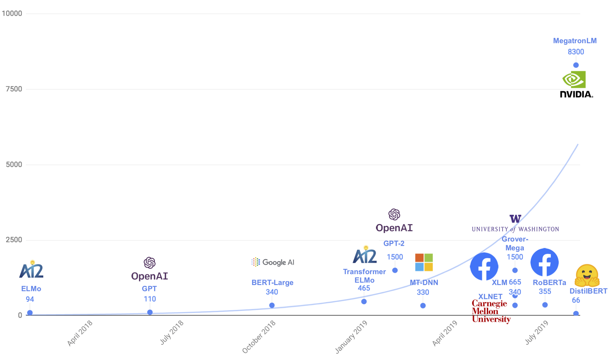
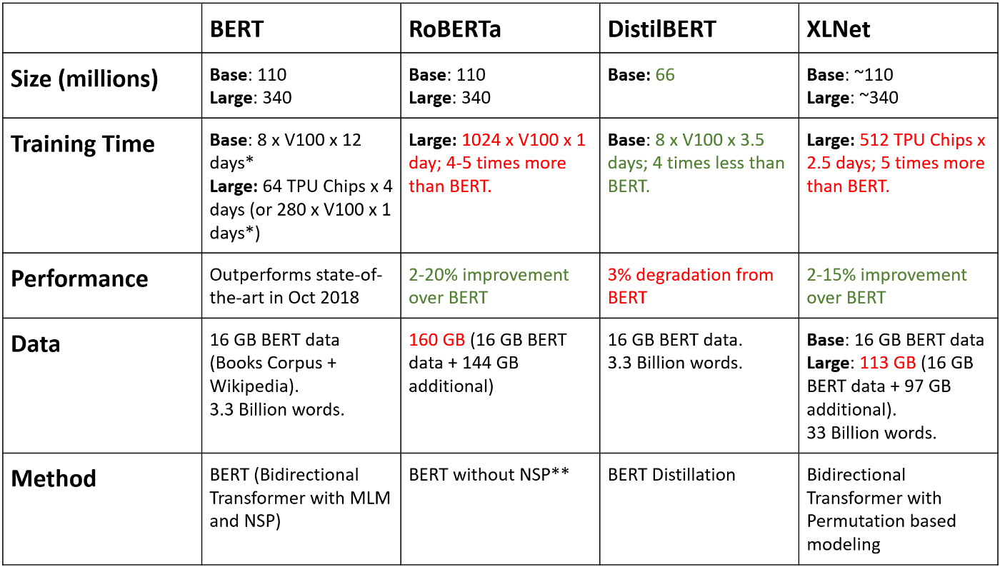

# DistilBERT Encoding and SQuAD Question Answering Model
A study on encoding english sentences to tensorflow vectors or tensors using pre-trained BERT model from the Hugging Face Library.

## Overview 

[BERT](https://arxiv.org/abs/1810.04805) (Bi-directional Encoder representation from Transformers) is a modern language model which can be used for sentence-encoding purposes for a wide variety of applications like sentiment analysis, embeddings, chatbots, text classification, etc. developed by researchers at [Google Language AI](https://research.google/teams/language/). BERT is designed to pre-train deep bidirectional representations from unlabeled text by jointly conditioning on both left and right context in all layers. As a result, the pre-trained BERT model can be fine-tuned with just one additional output layer to create state-of-the-art models for a wide range of tasks. Hence, BERT effectively paves a way for Transfer Learning in the domain of Natural Language Processing.

## BERT Models

We have used the BERT implementations on the popular [HuggingFace Library](https://huggingface.co/)

- [DistillBERT](https://huggingface.co/transformers/model_doc/distilbert.html)
- [RoBERTa](https://huggingface.co/transformers/model_doc/roberta.html)
- General Language Understanding Evaluation ([GLUE](https://gluebenchmark.com/))
- [BERT-base](https://huggingface.co/bert-base-uncased)
- [BERT-large](https://huggingface.co/bert-large-uncased)

### A Timeline of Various BERT Implementations

### A Functional Comparison of Some Modern BERT Implementations

### Fine-tuning BERT 

The pre-training of a BERT model is done by 2 main methods :
- Masked Language Model (MLM)
- Next Sentence Prediction (NSP)

Then, the weights of the pre-trained model are fine-tuned as required for a particular use case. We can refer [this paper](https://arxiv.org/pdf/1810.04805.pdf) to learn more about fine-tuning BERT for various specific tasks. 

## Study of BERT Encoding

Here we have studied the uncased [DistilBERT](https://arxiv.org/abs/1910.01108) model in detail, and how to implement it in practice to obtain the standard 768-dimensional feature vectors of any English sentence encoded using the pre-trained model. 

## [SQuAD](https://rajpurkar.github.io/SQuAD-explorer/) (Standford Question Answering Dataset) Model

SQuAD2.0 combines the 100,000 questions in SQuAD1.1 with over 50,000 unanswerable questions written adversarially by crowdworkers to look similar to answerable ones. To do well on SQuAD2.0, systems must not only answer questions when possible, but also determine when no answer is supported by the paragraph and abstain from answering.

Here, we have examined in detail this BERT-based model fine-tuned for the specific task of Question Answering. We have used the SQuAD implementation on the Huggingface library.

## References

* [Mobile BERT QA System (code in pure TF/Keras)](https://www.tensorflow.org/lite/models/bert_qa/overview)
* [Testing BERT based Question Answering on Coronavirus articles](https://towardsdatascience.com/testing-bert-based-question-answering-on-coronavirus-articles-13623637a4ff)
* [Examples of fine-tuning BERT on custom-data](https://huggingface.co/transformers/examples.html#squad)
